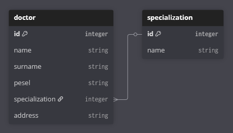

# Szpital

Projekt obejmuje podstawowe operacje związane z dodawaniem, usuwaniem oraz odczytywaniem lekarzy.

## Struktura projektu

Projekt został podzielony na dwie części - frontend oraz backend, a komunikacja między nimi odbywa się poprzez zapytania Rest API. Backend tworzy bazę danych w pliku `database.mv.db` znajdującego się w katalogu `backend`.

### Schemat bazy danych



### Frontend

Użyte technologie:

- React

### Backend

Oparty o Jave w wersji 25.

Użyte technologie:

- Spring Boot
- Lombok
- OpenAPI
- H2 Database

## Wymagania wstępne

- npm
- java

## Instalacja

- Frontend

```sh
cd frontend
npm install
npm run dev
```

- Backend
Kompilujemy kod przy użyciu Javy, a zarządzanie zależnościami realizowane jest przez Gradle.

## Generowanie przykładowych danych

Generowanie danych odbywa się poprzez ustawienie parametru

```properties
example.database=true
```

w pliku `application.properties`. Dane nie zostaną wygenerowane, gdy w bazie istnieje co najmniej jeden lekarz, aby zachować integralność danych.

## API

Api jest dostępne na backendzie z adresu `/swagger-ui.html`. Domyślnie jest to więc `localhost:8080/swagger-ui.html`.

## Opis wywołania funkcjonalności:

Na stronie głównej znajduje się lista wszystkich lekarzy wraz z przyciskami które umożliwiają wykonanie określonej akcji na danym lekarzu.


Wciśnięcie przycisku "Usuń" usuwa lekarza z listy, natomiast po wciśnięciu "Info" zostaną wyświetlone szczegółowe informacje dotyczące lekarza.


Aby dodać nowego lekarza należy wcisnąć przycisk "Dodaj lekarza", zostanie wyświetlony formularz, który umożliwi na wpisanie nowego lekarza na listę po wypełnieniu wszystkich wymaganych pól i zapisaniu.


## Autorzy

- Antoni Łakomy
- Dawid Szłapa
- Szymon Tworek
- Filip Żołnierczyk
